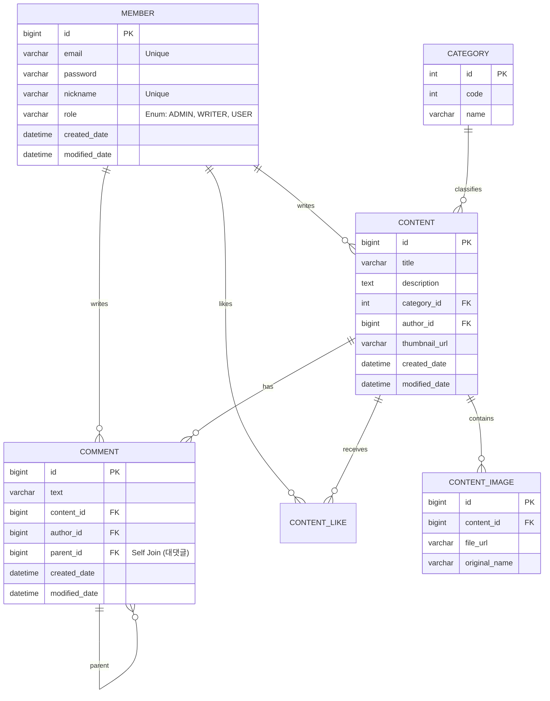

# 🚀 Indie Platform (Backend API Server)

Spring Boot 기반의 블로그/커뮤니티 플랫폼 백엔드 API 서버입니다.

**Spring Boot**와 **Redis**를 활용하여 동시성 문제를 해결하고, 대용량 트래픽 환경에서도 데이터 정합성과 성능을 모두 잡은 백엔드 API 프로젝트입니다.
**RESTful API** 설계 원칙을 준수하며, **안정적인 예외 처리**와 **확장 가능한 DB 설계**에 중점을 두었습니다.

---

## 🛠 Tech Stack

- **Language**: Java 17
- **Framework**: Spring Boot 3.5.9
- **Security**: Spring Security (Custom Configuration)
- **Database** | H2 (Dev), MySQL (Prod) |
- **NoSQL / Cache** | **Redis** (Docker) |
- **Test** | JUnit5, Mockito, **JMeter** (Load Testing) |
- **API Docs**: Swagger (SpringDoc OpenAPI)
- **Build Tool**: Gradle
- **Auth**: Session/Cookie (Custom Interceptor)

---

## 💾 ERD (Database Design)

회원, 게시글, 계층형 댓글(대댓글), 이미지 관리를 위한 데이터 모델링입니다.
**DBML/Mermaid**를 활용하여 구조를 시각화하였습니다.


- 설계 포인트: CONTENT 테이블에 like_count 컬럼을 추가(반정규화)하여, 목록 조회 시 COUNT(*) 쿼리 없이 빠르게 좋아요 수를 조회할 수 있도록 최적화했스빈다.

---

## 🏗 System Architecture (시스템 구조)

이 프로젝트의 핵심인 **'좋아요(Like)' 처리 프로세스**의 아키텍처입니다.
DB 부하를 최소화하기 위해 **Write-Back (지연 쓰기)** 전략을 채택했습니다.

```mermaid
flowchart LR
    User[User Client] -->|1. 좋아요 요청| Server[Spring Boot Server]
    
    subgraph "In-Memory (Fast)"
    Server -->|2. INCR (카운트 증가)| Redis[(Redis)]
    end
    
    subgraph "Disk Storage (Persist)"
    Scheduler[Like Scheduler] -->|3. 주기적 조회 (10s)| Redis
    Scheduler -->|4. Bulk Update (한방 쿼리)| DB[(MySQL / H2)]
    end

    style Redis fill:#ffcc00,stroke:#333,stroke-width:2px
    style DB fill:#00ccff,stroke:#333,stroke-width:2px

---

## API Response Format

모든 API 응답은 아래와 같은 통일된 JSON 구조를 따릅니다.

성공 시 (200 OK)
```json
{
  "status": "success",
  "message": null,
  "data": {
    "id": 1,
    "email": "user@example.com"
  }
}
```

1. 실시간 처리: 사용자의 '좋아요' 요청은 DB를 거치지 않고 Redis 메모리에서 즉시 처리됩니다. (응답 속도 ⚡️)

2. 비동기 동기화: LikeScheduler가 10초마다 Redis의 데이터를 취합하여 DB에 반영합니다.

3. 부하 감소: 1000명의 요청이 들어와도 DB에는 단 1번의 Update 쿼리만 실행됩니다.

실패 시 (400 Bad Request)
```json
{
  "status": "fail",
  "message": "이미 가입된 이메일입니다.",
  "data": null
}
```

---

## Key Technical Decisions

1. Global Exception Handling(@RestControllerAdvice)
    - 문제: 컨트롤러마다 반복되는 try-catch문과 제각각인 에러 응답 포맷.
    - 해결: GlobalExceptionHandler를 도입하여 예외를 전역적으로 가로채고, 표준화된 JSON 포맷(ApiResponse)으로 응답하도록 설계했습니다.
    - 결과: 비지니스 로직에만 집중할 수 있는 깔끔한 코드 구조 완성

2. Custom Spring Security
   - 문제: 기본 설정인 formLogin은 HTML 리다이렉트를 유발하여 REST API 클라이언트에 적합하지 않음.
   - 해결: 기본 로그인 폼을 비활성화(disable)하고, 컨트롤러에서 직접 세션을 제어하는 커스텀 로그인 API를 구현했습니다.
   - 특징: CSRF 설정 최적화 및 H2 Console 접근을 위한 X-Frame-Option 허용.

3. 계층형 댓글 구조 (Self-Join)
   - 구조: Comment 엔티티가 자기 자신을 parent로 참조하는 Self-Join방식을 적용했습니다.
   - 장점: 별도의 테이블 추가 없이 무한 대댓글(N-Depth) 구현이 가능하며, 데이터 무결성을 위해 orphanRemoval=true를 적용하여 부모 댓글 삭제 시 사직 댓글도 함께 정리되도록 했습니다.

4. Controller 편의성 개선(@SessionAttribute)
    - 개선: HttpServletRequest에서 세션을 직접 꺼내고 캐스팅하는 반복 코드를 제거하기 위해 @SessionAttribute를 적극 활용했습니다.
   
   ```java
    public ResponseEntity<?> write(
    @RequestBody WriteRequestDto dto,
    @SessionAttribute(name = "LOGIN_MEMBER") MemberDto member // 세션 자동 주입
    ) { ... }
   ```
   
---

## Feedback From AI(Gemini)

- CreatedDate와 LastModifiedDate는 어노테이션이다. 그러니 변수 타입으로 쓰는걸 주의하자.
- @ManyToOne과 @Column을 함께 쓸 수 없다. 그러니 @JoinColumn을 대신 쓰도록하자.


## 오늘의 회고

### 2026-01-23

    - Problem: 글 수정 테스트시 MockMvc가 Multipart요청을 기본적으로 POST만 보내서 400/500 에러 발생.
    - Solution : .with(req -> { req.setMethod("PUT"); return req;})를 사용하여 강제로 변경

    - Insight: 생성과 수정은 요구하는 데이터가 다르므로, DTO를 분리하는것이 유지보수 관리에 유리한거같다

    - Mistake : any()와 new ArrayList<>()를 섞어 써서 Mockito Stubbing 에러 발생 -> any()로 통일하거나 eq() 사용해야함.

### 2026-01-28
    오늘의 문제와 해결

    1. 동시성 이슈: 좋아요 데이터 증발 (Lost Update)
        - 문제 상황: JMeter로 100명이 동시에 좋아요를 눌렀을 때, DB에 약 50개만 저장되는 갱신 분실(Race Condition) 현상 발생
        - 원인: 여러 스레드가 동시에 DB의 like_count 값을 읽고 수정하는 과정에서 서로의 값을 덮어씌움.

    2. 해결 과정
        - 시도1 : 비관적 락(Pessimistic Lock)
            - 방법: DB 레벨에서 SELECT ... FOR UPDATE로 행을 잠금.
            - 결과: 데이터 정합성은 100% 해결되었으니, 모든 요청이 줄을 서서 처리되므로 응답 속도가 심각하게 저하됨(DB 병목)

        - 시도2: Redis Write-Back(최정 적용)
            - 방법: Redis의 Atomic Operation (INCR)을 사용하여 메모리에서 카운팅 후, 스케줄러가 DB에 일괄 반영.
            - 결과:
                - 정합성: Redis의 싱글 스레드 특성으로 동시성 문제 해결.
                - 성능: DB 업데이트 쿼리 수를 N번 -> 1번으로 감소시켜 처리량(Throughput) 극대화.

    3. 결과
        - 시나리오: JMeter로 사용자 100명이 1초내에 동시 가입 및 접속, 좋아요 클릭
        - 결과:
                - 데이터 유실률 0% 달성
                - Redis키에 누적되고, 스케줄러 실행 후 DB로 이관되는걸 확인
    