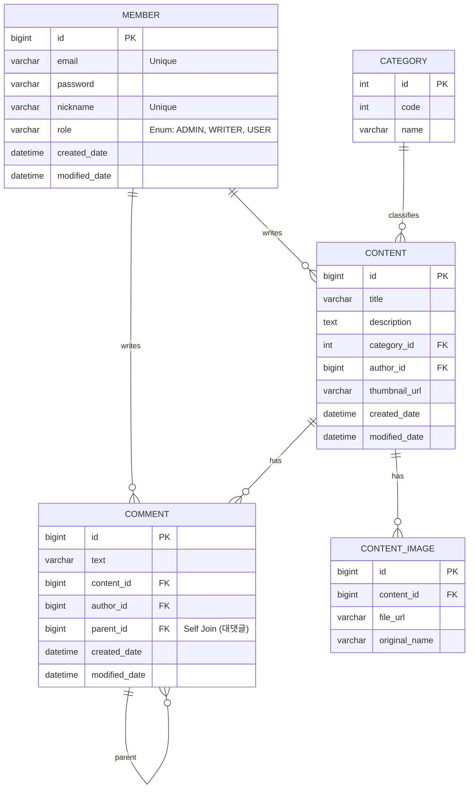

# 🚀 Indie Platform (Backend API Server)

Spring Boot 기반의 블로그/커뮤니티 플랫폼 백엔드 API 서버입니다.
**RESTful API** 설계 원칙을 준수하며, **안정적인 예외 처리**와 **확장 가능한 DB 설계**에 중점을 두었습니다.

---

## 🛠 Tech Stack

- **Language**: Java 17
- **Framework**: Spring Boot 3.5.9
- **Security**: Spring Security (Custom Configuration)
- **Database**: H2 (In-memory for Dev), JPA (Hibernate)
- **API Docs**: Swagger (SpringDoc OpenAPI)
- **Build Tool**: Gradle

---

## 💾 ERD (Database Design)

회원, 게시글, 계층형 댓글(대댓글), 이미지 관리를 위한 데이터 모델링입니다.
**DBML/Mermaid**를 활용하여 구조를 시각화하였습니다.



## API Response Format

모든 API 응답은 아래와 같은 통일된 JSON 구조를 따릅니다.

성공 시 (200 OK)
```json
{
  "status": "success",
  "message": null,
  "data": {
    "id": 1,
    "email": "user@example.com"
  }
}
```

실패 시 (400 Bad Request)
```json
{
  "status": "fail",
  "message": "이미 가입된 이메일입니다.",
  "data": null
}
```


## Key Technical Decisions

1. Global Exception Handling(@RestControllerAdvice)
    - 문제: 컨트롤러마다 반복되는 try-catch문과 제각각인 에러 응답 포맷.
    - 해결: GlobalExceptionHandler를 도입하여 예외를 전역적으로 가로채고, 표준화된 JSON 포맷(ApiResponse)으로 응답하도록 설계했습니다.
    - 결과: 비지니스 로직에만 집중할 수 있는 깔끔한 코드 구조 완성

2. Custom Spring Security
   - 문제: 기본 설정인 formLogin은 HTML 리다이렉트를 유발하여 REST API 클라이언트에 적합하지 않음.
   - 해결: 기본 로그인 폼을 비활성화(disable)하고, 컨트롤러에서 직접 세션을 제어하는 커스텀 로그인 API를 구현했습니다.
   - 특징: CSRF 설정 최적화 및 H2 Console 접근을 위한 X-Frame-Option 허용.

3. 계층형 댓글 구조 (Self-Join)
   - 구조: Comment 엔티티가 자기 자신을 parent로 참조하는 Self-Join방식을 적용했습니다.
   - 장점: 별도의 테이블 추가 없이 무한 대댓글(N-Depth) 구현이 가능하며, 데이터 무결성을 위해 orphanRemoval=true를 적용하여 부모 댓글 삭제 시 사직 댓글도 함께 정리되도록 했습니다.

4. Controller 편의성 개선(@SessionAttribute)
    - 개선: HttpServletRequest에서 세션을 직접 꺼내고 캐스팅하는 반복 코드를 제거하기 위해 @SessionAttribute를 적극 활용했습니다.
   
   ```java
    public ResponseEntity<?> write(
    @RequestBody WriteRequestDto dto,
    @SessionAttribute(name = "LOGIN_MEMBER") MemberDto member // 세션 자동 주입
    ) { ... }
   ```