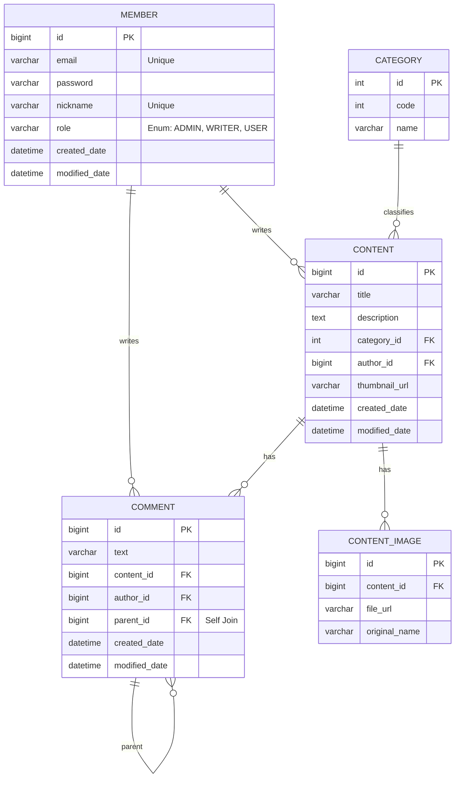

# Indie Platform

## 💾 ERD (Database Design)

```mermaid
erDiagram
    MEMBER ||--o{ CONTENT : writes
    MEMBER ||--o{ COMMENT : writes
    CATEGORY ||--o{ CONTENT : classifies
    CONTENT ||--o{ COMMENT : has
    CONTENT ||--o{ CONTENT_IMAGE : has
    COMMENT ||--o{ COMMENT : parent

    MEMBER {
        bigint id PK
        varchar email "Unique"
        varchar password
        varchar nickname "Unique"
        varchar role "Enum: ADMIN, WRITER, USER"
        datetime created_date
        datetime modified_date
    }

    CONTENT {
        bigint id PK
        varchar title
        text description
        int category_id FK
        bigint author_id FK
        varchar thumbnail_url
        datetime created_date
        datetime modified_date
    }

    CATEGORY {
        int id PK
        int code
        varchar name
    }

    COMMENT {
        bigint id PK
        varchar text
        bigint content_id FK
        bigint author_id FK
        bigint parent_id FK "Self Join"
        datetime created_date
        datetime modified_date
    }

    CONTENT_IMAGE {
        bigint id PK
        bigint content_id FK
        varchar file_url
        varchar original_name
    }
```