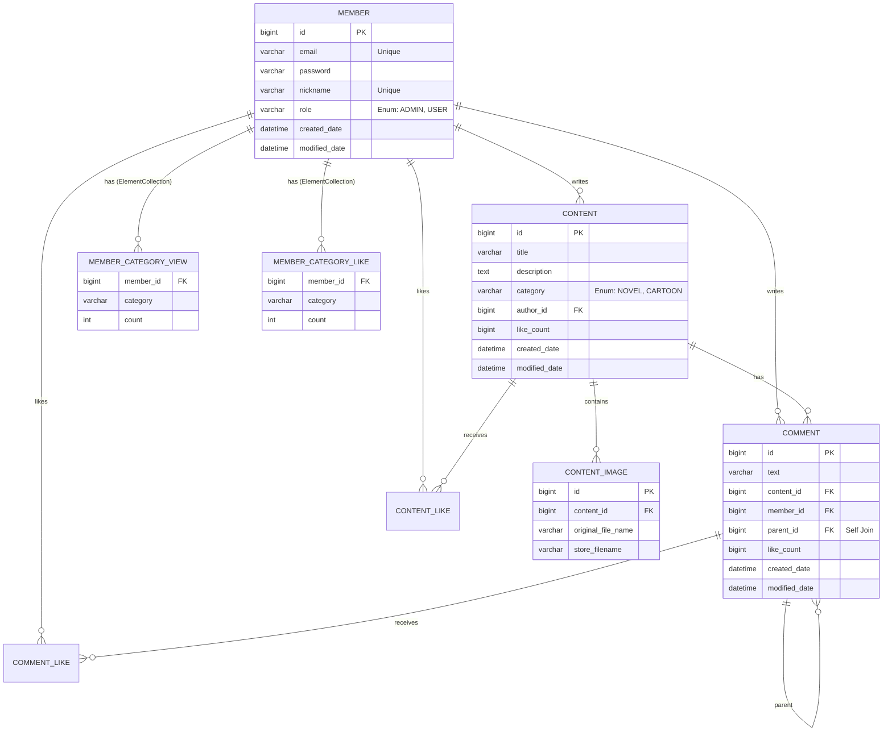
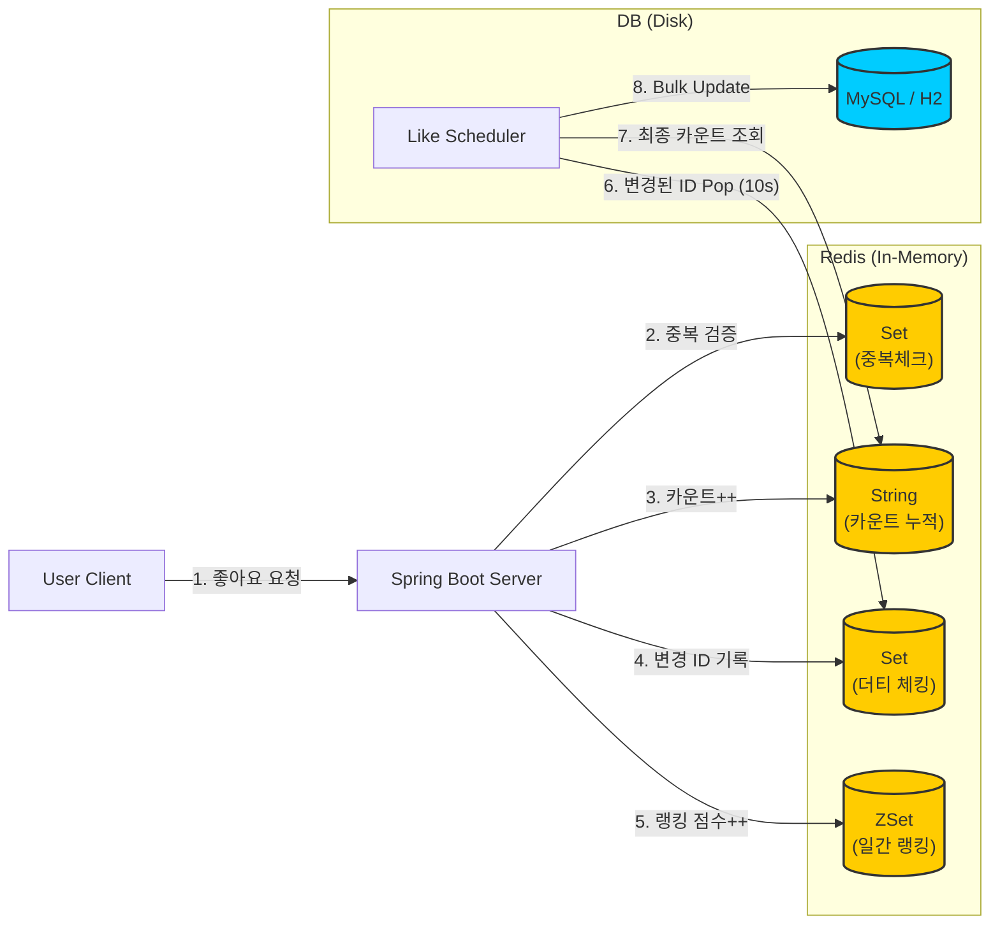

# 🚀 Indie Platform (Backend API Server)

Spring Boot 기반의 블로그/커뮤니티 플랫폼 백엔드 API 서버입니다.

**Spring Boot**와 **Redis**를 활용하여 동시성 문제를 해결하고, 대용량 트래픽 환경에서도 데이터 정합성과 성능을 모두 잡은 백엔드 API 프로젝트입니다.
**RESTful API** 설계 원칙을 준수하며, **안정적인 예외 처리**와 **확장 가능한 DB 설계**에 중점을 두었습니다.

---

## 🛠 Tech Stack

- **Language**: Java 17
- **Framework**: Spring Boot 3.5.9
- **Security**: Spring Security (Custom Configuration)
- **Database** | H2 (Dev), MySQL (Prod) |
- **NoSQL / Cache** | **Redis** (Docker) |
- **Test** | JUnit5, Mockito, **JMeter** (Load Testing) |
- **API Docs**: Swagger (SpringDoc OpenAPI)
- **Build Tool**: Gradle
- **Auth**: Session/Cookie (Custom Interceptor)

---

## 💾 ERD (Database Design)

회원, 게시글, 계층형 댓글(대댓글), 이미지 관리를 위한 데이터 모델링입니다.
**DBML/Mermaid**를 활용하여 구조를 시각화하였습니다.


```mermaid
erDiagram
    MEMBER ||--o{ CONTENT : writes
    MEMBER ||--o{ COMMENT : writes
    MEMBER ||--o{ CONTENT_LIKE : likes
    MEMBER ||--o{ COMMENT_LIKE : likes
    MEMBER ||--o{ MEMBER_CATEGORY_VIEW : "has (ElementCollection)"
    MEMBER ||--o{ MEMBER_CATEGORY_LIKE : "has (ElementCollection)"
    CONTENT ||--o{ COMMENT : has
    CONTENT ||--o{ CONTENT_IMAGE : contains
    CONTENT ||--o{ CONTENT_LIKE : receives
    COMMENT ||--o{ COMMENT : parent
    COMMENT ||--o{ COMMENT_LIKE : receives

    MEMBER {
        bigint id PK
        varchar email "Unique"
        varchar password
        varchar nickname "Unique"
        varchar role "Enum: ADMIN, USER"
        datetime created_date
        datetime modified_date
    }

    MEMBER_CATEGORY_VIEW {
        bigint member_id FK
        varchar category
        int count
    }

    MEMBER_CATEGORY_LIKE {
        bigint member_id FK
        varchar category
        int count
    }

    CONTENT {
        bigint id PK
        varchar title
        text description
        varchar category "Enum: NOVEL, CARTOON"
        bigint author_id FK
        bigint like_count
        datetime created_date
        datetime modified_date
    }

    COMMENT {
        bigint id PK
        varchar text
        bigint content_id FK
        bigint member_id FK
        bigint parent_id FK "Self Join"
        bigint like_count
        datetime created_date
        datetime modified_date
    }

    CONTENT_IMAGE {
        bigint id PK
        bigint content_id FK
        varchar original_file_name
        varchar store_filename
    }
```
- 설계 포인트: CONTENT 테이블에 like_count 컬럼을 추가(반정규화)하여, 목록 조회 시 COUNT(*) 쿼리 없이 빠르게 좋아요 수를 조회할 수 있도록 최적화했습닌다.

---

## 🏗 System Architecture (시스템 구조)

이 프로젝트의 핵심인 **'좋아요(Like)' 처리 프로세스**의 아키텍처입니다.
DB 부하를 최소화하기 위해 **Write-Back (지연 쓰기)** 전략을 채택했습니다.


```mermaid
flowchart LR
    User[User Client] -->|"1. 좋아요 요청"| Server[Spring Boot Server]
    
    subgraph "Redis (In-Memory)"
        RedisSet[("Set\n(중복체크)")]
        RedisCount[("String\n(카운트 누적)")]
        RedisDirty[("Set\n(더티 체킹)")]
        RedisZSet[("ZSet\n(일간 랭킹)")]
    end
    
    Server -->|"2. 중복 검증"| RedisSet
    Server -->|"3. 카운트++"| RedisCount
    Server -->|"4. 변경 ID 기록"| RedisDirty
    Server -->|"5. 랭킹 점수++"| RedisZSet
    
    subgraph "DB (Disk)"
        Scheduler[Like Scheduler] -->|"6. 변경된 ID Pop (10s)"| RedisDirty
        Scheduler -->|"7. 최종 카운트 조회"| RedisCount
        Scheduler -->|"8. Bulk Update"| DB[(MySQL / H2)]
    end

    style RedisSet fill:#ffcc00,stroke:#333,stroke-width:2px
    style RedisCount fill:#ffcc00,stroke:#333,stroke-width:2px
    style RedisDirty fill:#ffcc00,stroke:#333,stroke-width:2px
    style RedisZSet fill:#ffcc00,stroke:#333,stroke-width:2px
    style DB fill:#00ccff,stroke:#333,stroke-width:2px
```

1. 중복 검증 DB 쿼리 제거 (Zero DB Query for Validation): 기존에 좋아요 중복 확인을 위해 사용하던 existsBy... 쿼리를 제거하여, 불필요한 DB Read 병목을 해소했습니다.

2. Redis Set 기반 O(1) 중복 방지 및 더티 체킹: Redis의 Set 자료구조를 사용하여 O(1) 속도로 중복 클릭을 방지합니다. 또한, 또 다른 Set을 '더티 체킹' 용도로 활용하여, 스케줄러가 전체 데이터를 뒤지지 않고 pop()을 통해 10초 동안 변경(좋아요 증감)이 발생한 게시물 ID만 정확하게 가져오도록 구현했습니다.

3. Write-Back (지연 쓰기) 캐싱 전략: 트래픽이 몰릴 때 매번 DB에 쓰기(Write) 연산을 발생시키지 않고, 카운트 정보를 Redis 메모리에 모았다가 스케줄러가 10초마다 DB에 일괄 반영(Bulk Update)하도록 성능을 최적화했습니다.

   - 실시간 처리: 사용자의 '좋아요' 요청은 DB를 거치지 않고 Redis 메모리에서 즉시 처리됩니다. (응답 속도 ⚡️)

   - 비동기 동기화: LikeScheduler가 10초마다 Redis의 데이터를 취합하여 DB에 반영합니다.

   - 부하 감소: 1000명의 요청이 들어와도 DB에는 단 1번의 Update 쿼리만 실행됩니다.

---

## 🧠 Custom Feed Recommendation System (개인화 추천 피드)

회원의 활동(조회, 좋아요)을 바탕으로 취향을 분석하여, Redis List를 버퍼로 활용한 맞춤형 피드 제공 아키텍처입니다.

1. **사용자 벡터 추출:** Redis Hash에 누적된 유저의 카테고리별 활동 기록(조회, 좋아요)을 바탕으로 사용자 취향 벡터를 생성합니다.
2. **코사인 유사도 & 로그 스케일링 계산:** 커서 기반(No Offset)으로 DB에서 조회해 온 게시글들의 카테고리 벡터와 유저의 취향 벡터 간의 **코사인 유사도(Cosine Similarity)**를 계산하고, 게시글의 인기도(좋아요 수)에 **로그 스케일링(Log Scaling)**을 적용하여 점수를 산출합니다.
3. **유클리드 거리 정렬:** 취향 유사도와 인기도를 종합하여 이상적인 상태로부터의 **유클리드 거리**가 가장 짧은 순으로 게시물을 정렬합니다.
4. **Redis List 버퍼링 (N+1 최적화):** 정렬된 결과 중 사용자가 현재 페이지에서 볼 데이터 외의 나머지 데이터는 **Redis List**에 `rightPushAll`로 캐싱(Buffer)하여, 다음 페이지 요청 시 DB 정렬 연산 없이 O(1)에 가깝게 즉각 응답합니다.

---

## API Response Format

모든 API 응답은 아래와 같은 통일된 JSON 구조를 따릅니다.

성공 시 (200 OK)
```json
{
  "status": "success",
  "message": null,
  "data": {
    "id": 1,
    "email": "user@example.com"
  }
}
```

실패 시 (400 Bad Request)
```json
{
  "status": "fail",
  "message": "이미 가입된 이메일입니다.",
  "data": null
}
```

---

## Key Technical Decisions

1. Global Exception Handling(@RestControllerAdvice)
    - 문제: 컨트롤러마다 반복되는 try-catch문과 제각각인 에러 응답 포맷.
    - 해결: GlobalExceptionHandler를 도입하여 예외를 전역적으로 가로채고, 표준화된 JSON 포맷(ApiResponse)으로 응답하도록 설계했습니다.
    - 결과: 비지니스 로직에만 집중할 수 있는 깔끔한 코드 구조 완성

2. Custom Spring Security
   - 문제: 기본 설정인 formLogin은 HTML 리다이렉트를 유발하여 REST API 클라이언트에 적합하지 않음.
   - 해결: 기본 로그인 폼을 비활성화(disable)하고, 컨트롤러에서 직접 세션을 제어하는 커스텀 로그인 API를 구현했습니다.
   - 특징: CSRF 설정 최적화 및 H2 Console 접근을 위한 X-Frame-Option 허용.

3. 계층형 댓글 구조 (Self-Join)
   - 구조: Comment 엔티티가 자기 자신을 parent로 참조하는 Self-Join방식을 적용했습니다.
   - 장점: 별도의 테이블 추가 없이 무한 대댓글(N-Depth) 구현이 가능하며, 데이터 무결성을 위해 orphanRemoval=true를 적용하여 부모 댓글 삭제 시 사직 댓글도 함께 정리되도록 했습니다.

4. Controller 편의성 개선(@SessionAttribute)
    - 개선: HttpServletRequest에서 세션을 직접 꺼내고 캐스팅하는 반복 코드를 제거하기 위해 @SessionAttribute를 적극 활용했습니다.
   
   ```java
    public ResponseEntity<?> write(
    @RequestBody WriteRequestDto dto,
    @SessionAttribute(name = "LOGIN_MEMBER") MemberDto member // 세션 자동 주입
    ) { ... }
   ```
   
---

## Feedback From AI(Gemini)

- CreatedDate와 LastModifiedDate는 어노테이션이다. 그러니 변수 타입으로 쓰는걸 주의하자.
- @ManyToOne과 @Column을 함께 쓸 수 없다. 그러니 @JoinColumn을 대신 쓰도록하자.


## 오늘의 회고

### 2026-01-23

    - Problem: 글 수정 테스트시 MockMvc가 Multipart요청을 기본적으로 POST만 보내서 400/500 에러 발생.
    - Solution : .with(req -> { req.setMethod("PUT"); return req;})를 사용하여 강제로 변경

    - Insight: 생성과 수정은 요구하는 데이터가 다르므로, DTO를 분리하는것이 유지보수 관리에 유리한거같다

    - Mistake : any()와 new ArrayList<>()를 섞어 써서 Mockito Stubbing 에러 발생 -> any()로 통일하거나 eq() 사용해야함.

### 2026-01-28
    오늘의 학습 및 문제 해결

    1. 동시성 이슈: 좋아요 데이터 증발 (Lost Update)
        - 문제 상황: JMeter로 100명이 동시에 좋아요를 눌렀을 때, DB에 약 50개만 저장되는 갱신 분실(Race Condition) 현상 발생
        - 원인: 여러 스레드가 동시에 DB의 like_count 값을 읽고 수정하는 과정에서 서로의 값을 덮어씌움.

    2. 해결 과정
        - 시도1 : 비관적 락(Pessimistic Lock)
            - 방법: DB 레벨에서 SELECT ... FOR UPDATE로 행을 잠금.
            - 결과: 데이터 정합성은 100% 해결되었으니, 모든 요청이 줄을 서서 처리되므로 응답 속도가 심각하게 저하됨(DB 병목)

        - 시도2: Redis Write-Back(최정 적용)
            - 방법: Redis의 Atomic Operation (INCR)을 사용하여 메모리에서 카운팅 후, 스케줄러가 DB에 일괄 반영.
            - 결과:
                - 정합성: Redis의 싱글 스레드 특성으로 동시성 문제 해결.
                - 성능: DB 업데이트 쿼리 수를 N번 -> 1번으로 감소시켜 처리량(Throughput) 극대화.

    3. 결과
        - 시나리오: JMeter로 사용자 100명이 1초내에 동시 가입 및 접속, 좋아요 클릭
        - 결과:
                - 데이터 유실률 0% 달성
                - Redis키에 누적되고, 스케줄러 실행 후 DB로 이관되는걸 확인

### 2026-01-29
    오늘의 학습 및 문제 해결

    1. 조회 성능 개선 (NoSQL Caching): 중복 좋아요 체크 로직을 DB 조회(existsBy)에서 Redis Set 연산으로 대체하여 병목 저게.
    2. 확장성 설계 (Key Naming): 게시글(Content)와 댓글(Comment)의 키 충돌 방지를 위한 네임스페이스 설계 적용.

### 2026-02-01
    오늘의 학습 및 문제해결
    
    1. 랭킹순위 조회 구현

### 2026-02-02
    오늘의 학습 및 문제해결

    1. 랭킹순위 조회 테스트 코드 작성 및 성공

### 2026-02-5
오늘의 학습 및 움제해결

1. 랭킹 순위 조회 성공

### 2026-02-09
오늘의 학습 및 문제 해결

1. GithubAction으로 CI/CD 성공
2. AWS로 배포 성공

### 2026-02-10
오늘의 학습 및 문제 해결

1. 글 목록 조회시 N+1 문제해결(fetch-join)
2. 글 조회시 댓글 개수 제헌 (default_batch_fetch_size)

### 2026-02-11
오늘의 학습 및 문제 해결

1. 랭킹 조회시 회원과의 N+1 문제해결(fetch-join)
2. 글 상세 조회시 호원과의 N+1 문제해결(fetch-join)
3. 오류가 있던 테스트코드 수정(댓글 URI수정)

### 2026-03-01
오늘의 학습 및 문제 해결

1. 코사인 유사도와 유클리드 거드릴 이용한 추천글 목록 조회 구현 성공 및 테스트 코드 통과

### 2026-03-09~2026-03-11

<div style="padding-left: 20px;">

오늘의 학습 및 문제해결 

### 학습

  - Hiberanate는 JPA를 인스턴스화한 프레임워크이다. 즉, 실제 영속성 컨텍스트와 더티 체크를하여 실제 DB에 반영하는 실제 JPA의 인스턴스 객체이다.
    그리고 HikariCP는 실제 DB와 커넥션풀을 제공하는 프레임워크이다. 왜 HikariCP를 사용하냐면, 코드로 일일히 DB로 TCP/IP연결하여 3-Hand Shaking을 하기에는 처리가 너무 무겁고, 느리기 때문이다.
    그리하여 프로세스가 종료 될 떄까지 TCP/IP연결을 계속 유지하는 커넥션풀을 유지하여 필요할 때마다 사용하는 커넥션 풀이 등장하게 되었고, 그것이바로 HikariCP이다. 

  - 그런데 스프링부트에서 HikariCP의 스레드의 개수는 기본적으로 10개이고, 부족하다고 성능을 고려하지 않고 함부러 늘려버리면 웹서버에서는 OOM현상이 일어나거나 DB서버에서는 문맥교환만하는 스래싱현상이 일어날 것이다. 그래서 우선 로직상 DB를 통한 조회를 최소화 하는 방법을 도입힌다.그것은 다음과 같다.

  1. service단의 ContentService나 CommentService 기본로직에서 DB로 SELECT처리를 최소화하여야 한다.
  2. Security에서의 JWT이든 Session이든 회원을 검증하기 때문에, service단에서 DB를 통해 회원을 조회하여 검증할 필요는 없다. 그러니 회원조회 코드는 과감하게 삭제한다.
  3. 추천시 Content식별을 위한 DB 조회는 Redis를 통해 캐싱 전략을 사용하는데 방법은 다음과 같다. A를 먼저 적용해보고, B를 적용해보겠다.
    
     > - A: 글을 저장이나 조회시 Redis의 특정한 Set에 ContentId를 저장해두고, API 호출시에 Set에서 해등 ContentId, CommentId가 있는지 조회한다.
     >   - 결과:
     >       - H2를 DB로두고, 톰캣 스레드를 100개로 가정하고, 10000개의 요청 시 : 성공 9초 672ms
     >       - H2를 DB로두고, 톰캣 스레드를 100개로 가정하고, 50000개의 요청 시 : 성공 27초 242ms (메모리 늘리고 테스트)

      > - B: Write-Back 패턴을 이용하는데, API가 호출되면 Redis의 Set에 수정된 ContentId나 CommentId를 더티체크한다. 그리고 스케줄러로 정해진 시간마다 더티체크를 확인하여 갱신한다. 가장 많이 쓰이는 방식이라고 한다.
      >  - 결과:
            - MySql을 DB로 두고, 톰캣 스레드를 100개로 가정하고, 50000개의 요청 시 : 성공 24초 626ms (메모리 늘리고 테스트)

  - 참고로, 톰캣의 스레드풀이 스프링의 로직을 돌리는 시간에 비해, HikariCP같은 DB 파이프를 통해 쿼리를 쏘고 결과를 받아오는 시간은 보통 수 밀리초(ms) 단위로 찰나의 순간이다. 그래서 커넥션 스레드의 수가 10개 뿐이더라도, 워낙 눈 깜짝할 새에 쓰고 반갑하기 때문에 톰캣 200개의 스레드가 금방 처리 될 수있다.
  그래서 커넥션 풀의 수를 함부러 늘리지 말고, 로직을 최대한 최적화하고, 그 후에 Jmeter같은 부하테스트 도구로 5만 건 이상의 트래픽을 쏴보고, HikariCP의 대기 시간이나 DB서버의 CPU사용률을 모니터링하면서 조율하는것을 권장한다고 한다.
  HikariCP를 만든 제작자와 PostgresSQL 공식 문서에서 권장하는 최적의 커넥션 풀 사이즈 공식은 다음과 같다.

    > Ideal Connection Pool size = (DB 서버의 CPU 코어 수 * 2) + 유요한 디스크 수
    
    - 코어 수 * 2: CPU 코어가 쉬지 않고 일할 수 있도록 약간의 여유를 두는 정도
    - 유효한 디스크 수: 하드디스크(HDD)시절에는 디스크 헤드가 돌아가는 대기 시간이 있어서 숫자를 더했지만, 요즘 같은 SSD 환경에서는 보통 '1'로 계산한다고 한다.

  - JPA를 쓸때는 <code>save()</code>를 <cdoe>for</code>문 안에서 돌리는 것은 대용량 처리에서 절대 피해야 할 안티 패턴이다.
  - JPA의 <code>saveAll()</code>사용 시 주의할것이 있다. 만약 MySQL을 사용하는데 IDENTITY전략을 사용한다면, Hibernate는 이 IDENTITY 전략을 사용할 때, 다중 삽입(Batch Insert)기능을 강제로 꺼버린다. 왜냐하면, MySQL의
    IDENTITY는 INSERT 쿼리를 때려봐야 DB가 생성해 준 ID값을 알 수 있기때문이다. JPA는 엔티티를 그 객체의 ID를 가지고 식별한다. 결국에는 <code>saveAll()</code>로 1만개를 한 번에 묶어서(Batch) 보내고 싶어도, 당장 1개씩 DB에 밀어넣고 ID를 받아와야하는 N+1문제가 생기게된다.
    또한, <code>saveAll()</code>를 사용하면 1차 캐시인 영속성 컨텍스트에 데이터를 차곡차곡 쌓아두기때문에, 1만개의 데이터를 저장한다치면 OOM(Out of Memory)현상이 일어날 수 있다.
    그러니 IDENTITY전략을 사용하는 MySQL이나 MariaDB를 사용할 때는, <code>saveAll()</code> 대신에 MyBatis나 <code>JdbcTemplate.batchUpdate()</code>를 사용하도록한다.
  - Oracle이나 PostgreSql Sequence라는 객체를 지원하여 DB로부터 미리 쓸 ID를 가져와서 저장해 놓다가, 필요하면 ID를 부여하는 선 발급, 후 적용을 지원한다. 그러니 <code>saveAll()</code>을 사용하여도 무방하다.
  - RDS의 max_connections의 값은 <code>(최대 동시 접속 사용자 수) + (시스템 여유분)</code>가 바람직하며, 학습용/테스트용 프리티어라면 150~300사이로 설정한다.
    5만 건 적재 테스트 시 스레드 풀을 크게 잡았다면, HikariCP의 <code>maximum-pool-size</code>보다 20~30% 더 넉넉하게 설정해야 안전하다.
  - HikariCP의 커넥션 수만 늘린다고 되는게 아니라, DB의 커넥션이 오랫동안 점유되지 않도록 wait_timeout이나 interactive_timeout을 적절히 줄여줘야 오랫동안 점유되지 않고 커넥션을 회수할 수 있다.
    실시간 커넥션 사용 확인 쿼리: <code>SHOW STATUS LIKE 'Threads_connected';</code>

### 작업 리스트

- [x] Task1: 테스트 환경 최적화 (JDBC Bulk Insert 도입)
  - 목표: 5만건 세팅 시 발생했던 OOM(메모리 초과)의 근본 원인인 JPA <code>saveAll()</code>을 도려낸다.
  - 액션: 테스트 코드의 <code>@BeforeEach</code>나 <code>given</code> 구역에 순수 SQL 실행기인 <code>JdbcTemplate.batchUpdate()</code>를 적용하여 5만건의 데이터가 1~2초만에 영속성 컨텍스트(1차 캐시)를 거치지 않고 DB로 직행하도록한다.

- [x] Task2: addLike의 완벽한 다이어트 (DB의존성 0%)
  - 목표: 좋아요 API 호출 시 DB로 가는 쿼리를 완전히 없앤다.
  - 액션: addLike 서비스 로직안에서 memberRepository와 ContentRepository를 조회하는 로직을 과감히 삭제하고 오직 Redis에 값을 add하는 코드만 남기도록 한다.

- [x] Task3: 'Write-Back' 배치 스케줄러 구현
  - 목표: Redis에 모인 좋아요 데이터를 RDB로 영구 저장한다.
  - 액션: 스프링의 <code>@Scheduled</code> 어노테이션을 활용해 10초에 한 번씩 실행되는 메서드를 만든다.

- [x] Task 4: RDS의 DB 커넥션과 HikariCP Size를 설정
  - RDS의 max_connections값을 150, HikariCP의 maximum-pool-size값을 50으로 설정
  - RDS의 wait_timeout값을 60, interactive_timeout을 60으로 설정하여 커넥션 자원가 오랜시간 점유되지 않도록 설정
  - HikariCP의 max-lifetime값을 waite_timeout보다 30초 짧게 설정하여 '이미 끊긴 연결'을 참조하지 못하도록 방지.

### 해결 과정
- 내 생각과는 다르게, INSERT, DELETE, UPDATE도 응답을 기다려야 하는 처리이다. 그렇기 때문에, DB 커넥션풀의 소켓을 사용하게된다. 여기서의 핵심은 DB커넥션의 사용을 비동기 처리하여서 병목현상을 최소화하는것이다. 그러기 위해서는 Write-Back 아케턱처로 네트워크 처리는 네트워크 처리대로, DB 처리는 DB처리 대로 따로 비동기적으로 처리해야한다.
- JPA에서 <code>for</code>문 안에서 <code>save()</code>를 돌리는 것은 대용량 처리에서 절대 피해야할 안티패턴이다. 또한, Redis는 디스크 I/O가 아니라 RAM에 데이터를 저장하는 프로세스이다. 그러니 필요없는 데이터는 Redis에서 지워야한다.
- 위와 같은 JPA의 문제를 해결하기 위해서는 Queue패턴을 도입하는데, 방법은 다음과 같다.
  > addLike와 같은 생산자에서 <code>RightPush</code>로 밀어 넣고, syncLikeCount(소비자)와 같이 1000개분을 LeftPop하여 JdbcTemplate.batchUpdate()</code>를 이용해 단 1번의 쿼리로 DB에 꽂아 넣는다.
- 50000개의 요청에 대응하기 위해서는 HikariCP의 I/O비용을 최소화하여야 한다. 그러하기 위해서는 서비스 로직에서 실제 DB에 INSERT, UPDATE, DELETE처리시
Redis에 더티체크하였다가 일정시간마다 스케줄러를 실행한다. 그래서 addLike의 JPA 조회, 삽입, 삭제처리를 없앴고, 생산자-소비자 큐 구조로 Redis에 넣어 더티체크를 하였다. 
그러나서 스케줄러가 일정 시간마다 pop을 하여서 DB에 반영하도록하였다. `그리하여서 50000요청 테스트 결과 11초 504ms라는 시간으로 통과하였다.`
- 오늘 H2 DB에서 MySQL로 데이터베이스르 바꿨다. AWS의 RDS를 이용하도록한다. 데이터베이스를 알아서 관리해주는 서비스인거같다.
</div>

### 2026-03-12-~2026-03-13

<div style="padding-left: 20px;">

오늘의 학습 및 문제해결

### 학습

- 테스트코드를 작성시에 given이나 then이든 eq등으로 인자를 깐깐하게 점검하는게 좋다. 왜냐하면 로직이 복잡해지기 시작하면, 에러가 났을 때 데이터의 흐름을
  짚지 못하기 때문이다.
- any()를 쓰면 메서드의 인자에 eq()나 any() Matcher 메서드를 반드시 사용해야한다.
- any()는 이 테스트 시나리오에서는 이 인자 값이 무엇이든 논리적으로 좋요치 않거나 테스트 할 때 랜덤하게 값이 바뀌어 도저히 예측할 수 없을 경우에 사용한다.
- given은 반환값이 없다면 생략하는게 보통이지만, Mockito가 순서를 오해할 수 있는 경우가 있다. 이 때는 given을 명시해주거나 lenient().give()절을 써주면 된다.

### 작업 리스트

- [x] Task1: 댓글 좋아요 Writ-Back구조로 만들기 (글 좋아요시 I/O 횟수를 최소화 하기 위해서)
  - [X] 댓글 작성시 Redis에 글 번호 저장 및 테스트 코드 수정 
  - [X] 댓글 삭제시 Redis에 글 번소 삭제 및 테스트 코그 수정
  - [X] 댓글 좋아요 Write-Back구조로 수정 및 테스트 코드 수정 (Redis 캐스 히트 성공, Redis 캐스 미스 성공, 댓글 미존재, 중복)
  - [X] 댓글 좋아요 취소 Write-Back구조로 수정 및 테스트 코드 수정 (Redis 캐스 히트 성공, Redis 캐스 미스 성공, 댓글 미존재, 미존재 실패)
  - [X] 댓글 좋아요 DB에 반영할 스케줄러 작성
  
- [X] Task2: 글 좋아요 Write-Back구조의 N+1문제 및 최적화
  - [X] 글 좋아요를 하나씩 가져오기 -> 한꺼번에 가져오기
  - [X] 트랜잭션과 스케줄러 분리
  - [X] 큐에서 pop하는게 아니라 DB에 반영 후 trim하여 크기를 줄이기
  - [x] 글 좋아요 테스트 코드 수정 (좋아요 성공 캐시 히트, 좋아요 성공 캐시 미스, 글 미존재, 좋아요 중복)

- [X] Task3: 글 좋아요 취소 Write-Back구조의 N+1문제 및 최적화
    - [X] 글 좋아요 취소를 하나씩 가져오기 -> 한꺼번에 가져오기
    - [X] 트랜잭션과 스케줄러 분리
    - [X] 큐에서 pop하는게 아니라 DB에 반영 후 trim하여 크기를 줄이기
    - [x] 글 좋아요 취소 테스트 코드 수정 (Redis 캐스 히트 성공, Redis 캐스 미스 성공, 글 미존재, 좋아요 미존재)

### 성과

- 로컬 기준 MySql를 DB로두고, 톰캣 스레드를 100개로 가정하고, 1000개의 요청 시 : 성공 9초 672ms -> 1초 189 (메로리 안늘림)
- 로컬 기준 MySql을 DB로 두고, 톰캣 스레드를 100개로 가정하고, 50000개의 요청 시 : 성공 24초 626ms -> 12초 241ms (메로리 안늘림)

- 로컬 기준 MySql를 DB로두고, 톰캣 스레드를 100개로 가정하고, 1000개의 댓글 좋아요 요청 시 : 성공 1초 256ms (메로리 안늘림)
- 로컬 기준 MySql을 DB로 두고, 톰캣 스레드를 100개로 가정하고, 50000개의 댓글 좋아요 요청 시 : 성공 13초 760ms (메로리 안늘림)

</div>